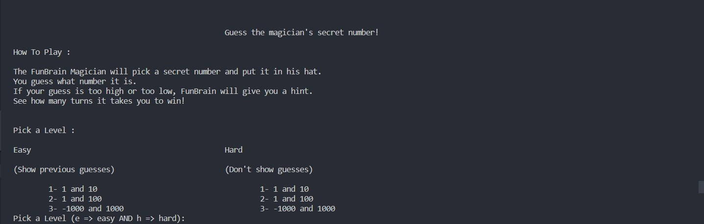
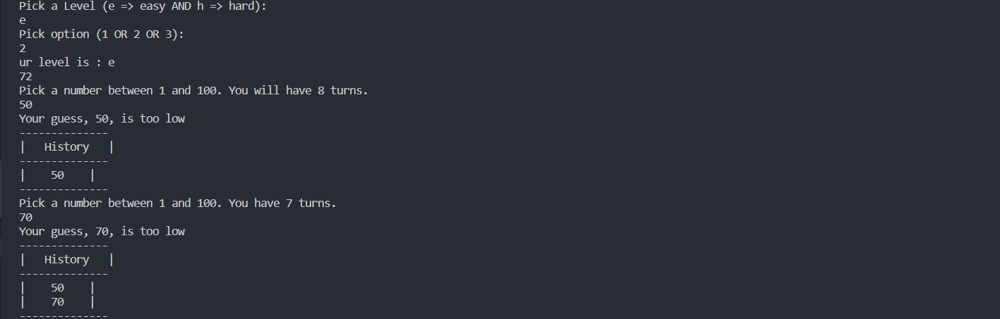
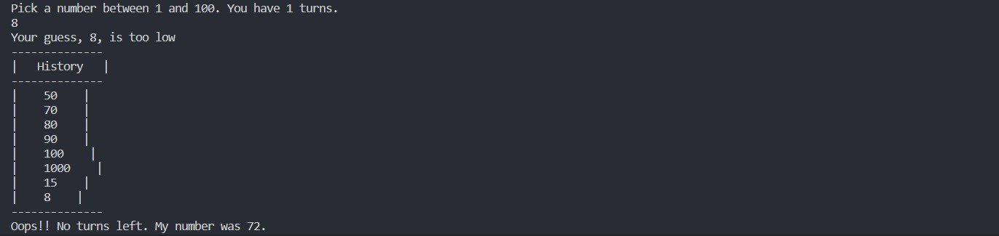

# Project Name
> Guess Number Game with java.
> not a Live demo [_here_](https://github.com/splach-coder/Guess-Game). 

## Technologies Used
-java language

## Features
NO Feature just a native java.

## Screenshots

## Project Status
Project is: _in progress_.
If you are free to add some code feel free working on it.

## Acknowledgements
- This project was inspired by the guess number game
- Many thanks to me.

## Contact
Created by [@splash-coder]- feel free to contact me!